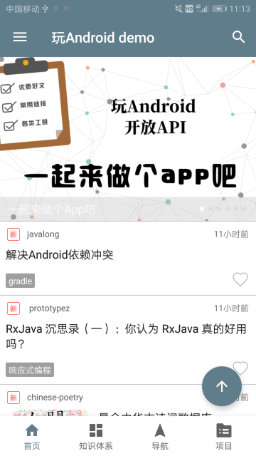
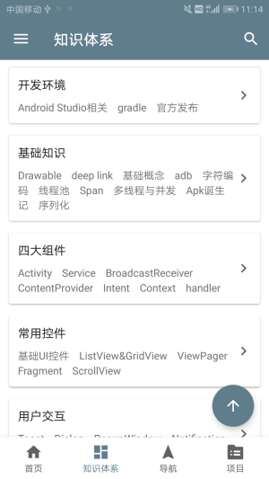
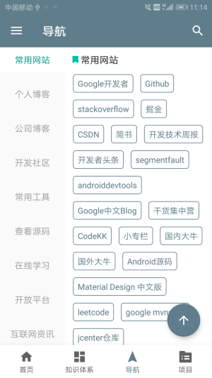
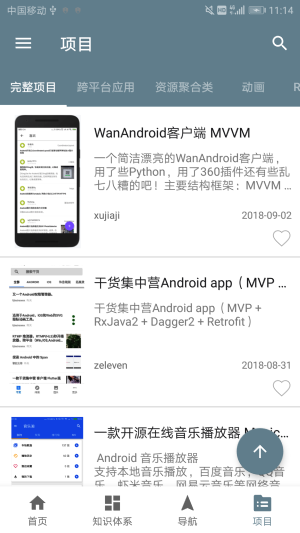
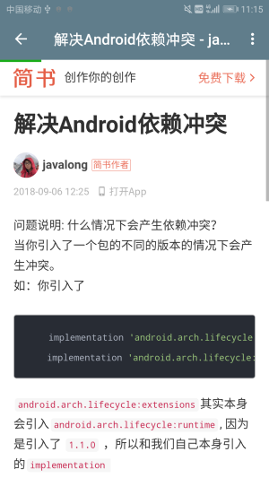
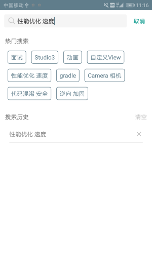
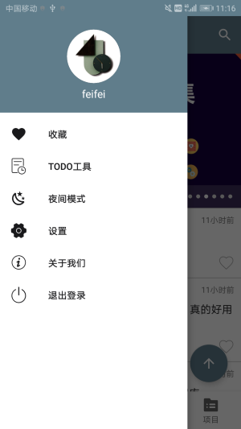
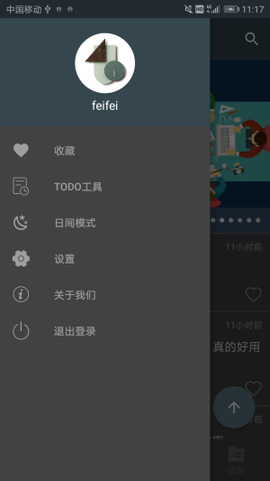

# WanApp

本代码时学习github上的开源框架WanAndroid时边学习kotlin边按照开源代码敲出来的 

WanAndroid开源框架地址请点击[GitHub](https://github.com/iceCola7/WanAndroid)

[相关接口使用的Api说明](http://www.wanandroid.com/blog/show/2)

### 模块介绍

该项目大体分为以下四个模块：

* 首页：主要是轮播图展示和文章列表
* 知识体系
* 导航：知识点导航
* 项目：项目列表展示

### 页面展示

   
    
    
   

